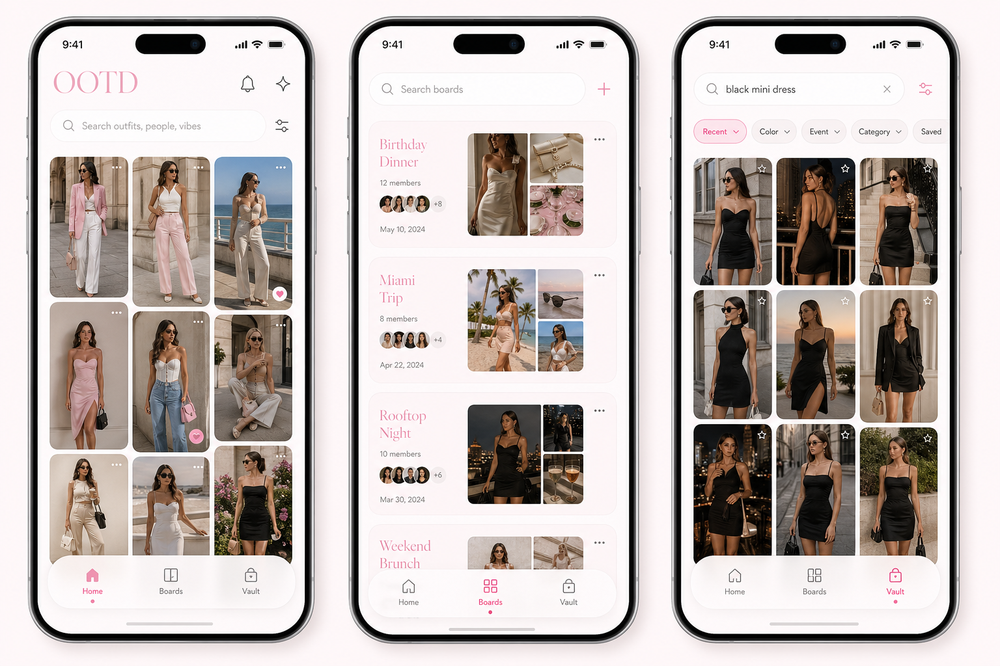
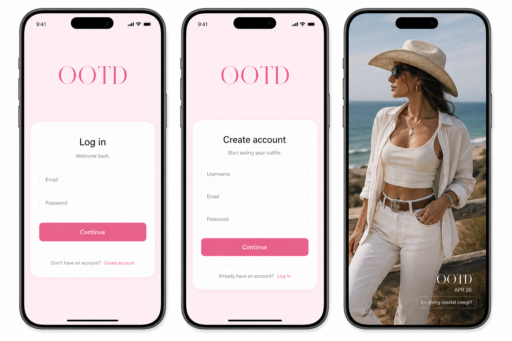

# UI Inspiration

This captures the current visual direction for the OOTD redesign.

## Direction

- Modern, simple, smooth, and Pinterest-like.
- White-first interface with very light pink accents.
- Pink should be soft and restrained, not neon or busy.
- Use search as a primary object across the app.
- Avoid decorative fashion clutter, heavy sparkles, stickers, chrome, and overly cute copy.

## Core App Structure

- **Home**: the user's feed.
- **Boards**: outfit boards the user is part of.
- **Vault**: all pictures of the user, with search and sort/filter controls.

## Auth And Story

- Auth screens can use a plain soft pink background with white form cards.
- Keep the copy direct: `Log in`, `Create account`, `Continue`.
- Instagram story export should stay photo-first.
- Story overlay should be small in the bottom-right corner, not a large box.
- Story text should be short, like `it's giving coastal cowgirl`.

